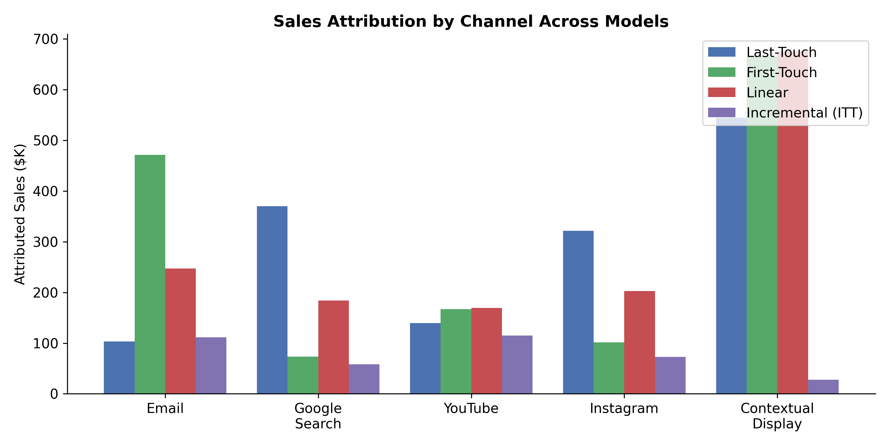
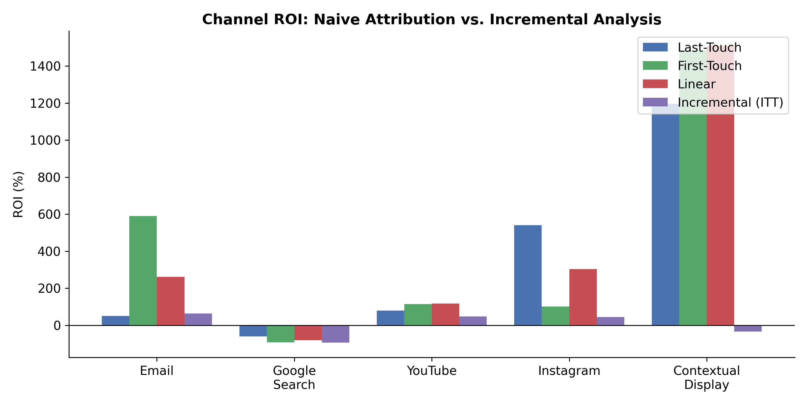
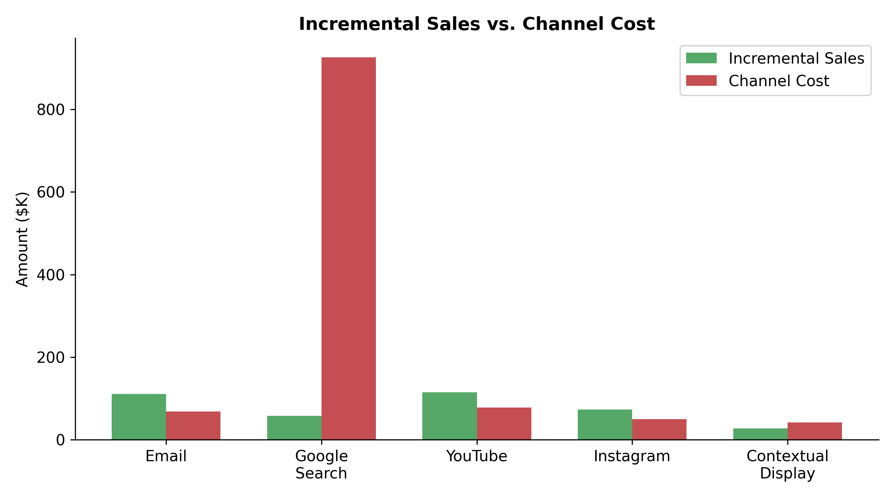
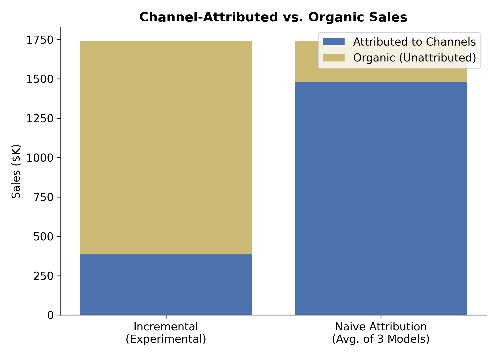

# Patagonia Marketing Attribution & Incrementality Analysis

## Problem

Patagonia runs marketing campaigns across five digital channels — email, YouTube, Instagram, Google Search, and contextual display — but lacked a rigorous framework for measuring which channels truly drive sales versus which simply touch customers who would have purchased anyway. Leadership questioned whether standard attribution models (last-touch, first-touch, linear) were sufficient to guide marketing investment, or whether a more causal, experiment-driven approach was needed.

This analysis uses data from a randomized controlled experiment conducted over a three-week period to compare naive attribution models against incremental (intent-to-treat) estimation, quantify each channel's true causal impact on sales, and calculate channel-level ROI.

## Key Findings

- **Naive attribution models overstate marketing impact by ~4x.** All three naive models attribute $1.48M in sales to the five channels, while the experimental incremental approach attributes only $385K — meaning roughly $1.36M in sales were organic and would have occurred without any marketing.
- **Contextual display is the most overstated channel.** Naive models rank it as the highest-ROI channel (up to 1,509% ROI under linear attribution), but incremental analysis reveals it has a **negative ROI of -33%** and its treatment effect is not statistically significant.
- **Email and YouTube are the highest-performing channels** on an incremental basis, with ROIs of 63% and 47% respectively and statistically significant treatment effects.
- **Google Search has a deeply negative incremental ROI (-94%)**, driven by a high cost-per-click ($2.30) relative to its modest lift in sales.
- **The choice of attribution model dramatically changes channel rankings**, making it unreliable as a sole basis for budget allocation decisions.

## Dataset

The dataset contains 2 million customer records from a three-week randomized experiment. Each customer was independently randomized into treatment or holdout for each of the five marketing channels (80/20 split). Key variables include:

- **Treatment indicators** (`email_T`, `youtube_T`, etc.) — whether the customer was eligible to receive ads on each channel
- **Touchpoint counts** — number of ad interactions per channel
- **Sales** — revenue generated during the study period
- **Customer attributes** — age, gender, purchase history, site engagement metrics
- **Attribution fields** — first-touch and last-touch channel identifiers

## Methodology

The analysis proceeds in four stages:

1. **Naive Attribution Modeling** — Sales are attributed to channels using last-touch, first-touch, and linear models. These heuristic approaches assign credit based on the sequence or frequency of ad interactions, without accounting for what would have happened in the absence of marketing.

2. **Incremental (Intent-to-Treat) Estimation** — For each channel, the average sales of customers in the treatment group are compared to those in the holdout group. Because treatment assignment was randomized, the difference in means provides a causal estimate of each channel's impact on sales. A randomization check (75 balance tests across covariates) confirmed that treatment and control groups were well-balanced, with only 3 imbalances detected — within the expected false-positive rate at α = 0.05.

3. **Regression-Based Estimation** — An OLS regression models sales as a function of all five treatment indicators simultaneously, controlling for customer demographics and behavioral history. This adjusts for any residual overlap across channels. Interaction terms between channels (e.g., YouTube × Instagram) and between channels and customer characteristics (e.g., Google Search × purchase history) were explored but found to be statistically insignificant, likely due to the experiment's power constraints.

4. **ROI Calculation** — Channel costs are computed from touchpoint volumes and per-touchpoint cost rates. ROI is calculated under both the incremental framework and each naive attribution model to highlight how model choice affects investment conclusions.

## Results

### Attribution Model Comparison

Naive models consistently overattribute sales to channels, particularly contextual display, which benefits from low-cost, high-volume impressions that "touch" many customers without necessarily influencing their behavior.



### Channel ROI

When measured incrementally, only three of five channels deliver positive ROI. The naive models paint a drastically different — and misleading — picture, particularly for contextual display and Instagram.

| Channel | Incremental ROI | Last-Touch ROI | First-Touch ROI | Linear ROI |
|---|---|---|---|---|
| Email | **+63%** | +51% | +590% | +262% |
| YouTube | **+47%** | +80% | +115% | +118% |
| Instagram | **+46%** | +541% | +102% | +304% |
| Google Search | **-94%** | -60% | -92% | -80% |
| Contextual Display | **-33%** | +1,197% | +1,486% | +1,509% |



### Incremental Sales vs. Cost

Google Search stands out as significantly over-invested relative to its incremental return, while email and YouTube generate returns that meaningfully exceed their costs.



### Organic Sales

The experimental approach reveals that approximately 78% of total sales ($1.36M of $1.74M) are organic — driven by brand equity, prior customer satisfaction, and factors outside the scope of these five channels. Naive models estimate organic sales at only $262K, implying nearly all revenue is marketing-driven.



## Conclusion

Simple attribution models are not "close enough." The channel that every naive model identifies as the highest-ROI investment (contextual display) is actually delivering negative incremental returns. Relying on these models would lead Patagonia to over-invest in low-impact channels and under-invest in genuinely effective ones like email and YouTube.

The incremental approach, grounded in randomized experimentation, provides a far more accurate basis for marketing budget allocation. That said, several limitations apply:

- **Short measurement window** — the three-week study captures only immediate effects, not long-term brand building or delayed conversions
- **Intent-to-treat scope** — not all treated customers were actually exposed to ads, which may understate true per-exposure effects
- **No sequencing insights** — the analysis evaluates channels independently and cannot identify optimal touchpoint ordering or funnel effects
- **Potential spillover** — holdout customers may have been indirectly exposed to marketing (e.g., word-of-mouth, shared screens), which would attenuate measured treatment effects

Despite these caveats, the divergence between naive and incremental results is large enough to warrant a shift toward experiment-based measurement for marketing investment decisions.

## Repository Structure

```
├── Patagonia.ipynb          # Full analysis notebook
├── data/
│   └── patagonia.csv        # Customer-level experiment data (2M rows)
├── outputs/                 # Generated visualizations
│   ├── attribution_comparison_by_model.png
│   ├── roi_comparison_by_model.png
│   ├── incremental_sales_vs_cost.png
│   └── attributed_vs_organic_sales.png
├── generate_charts.py       # Chart generation script
└── README.md
```

## How to Run

1. Ensure Python 3.x is installed with `pandas`, `numpy`, `statsmodels`, `scipy`, `matplotlib`, and `seaborn`.
2. Open `Patagonia.ipynb` in Jupyter Notebook or JupyterLab and run all cells.
3. To regenerate charts independently: `python generate_charts.py`

## Visualization Code

The charts above are generated by [`generate_charts.py`](generate_charts.py), which uses only metrics computed in the analysis notebook. Key visualizations:

1. **Attribution Comparison** — grouped bar chart comparing attributed sales across all four models
2. **ROI Comparison** — grouped bar chart of channel ROI under each attribution approach
3. **Incremental Sales vs. Cost** — side-by-side comparison of each channel's causal revenue impact against its cost
4. **Attributed vs. Organic Sales** — stacked bar chart showing how much of total revenue is marketing-driven vs. organic under each framework
